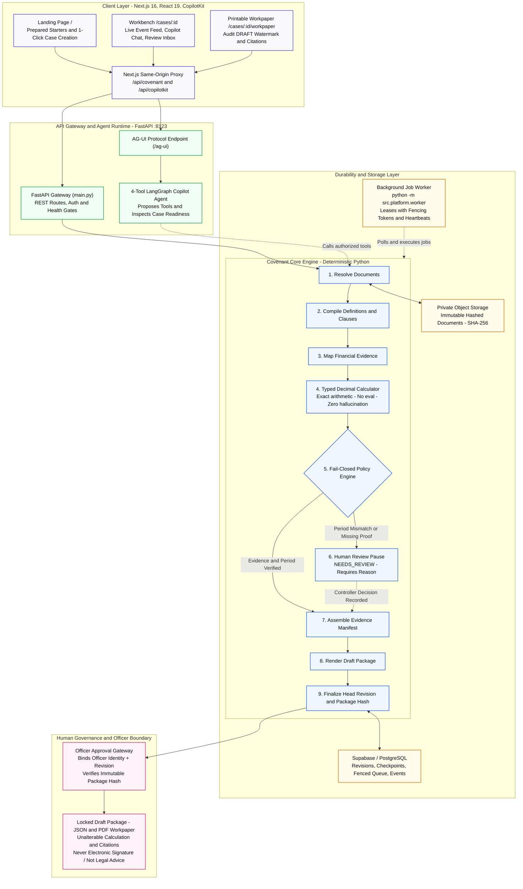

<div align="center">
  
  <h1>Covenant Certificate</h1>
  <p><strong>Evidence-first loan covenant compliance workflow for borrower-side treasury teams</strong></p>
  <p><em>Track 2 — Autonomous Office of the CFO · Syndicate by Maximor</em></p>
  <p>
    <a href="#what-the-demo-shows">Demo Walkthrough</a> •
    <a href="#architecture">Architecture</a> •
    <a href="#run-locally">Run Locally</a> •
    <a href="#api">API Reference</a> •
    <a href="#evaluation--measurable-results">Evaluation</a>
  </p>
</div>

---

Borrower-side treasury teams prepare loan-covenant compliance certificates by hand: the credit agreement's own definitions decide what counts as debt and EBITDA, the measurement period has to match, amendments change thresholds mid-life, and an authorized officer signs. Getting it wrong is an event of default. **Covenant Certificate** automates that workflow end to end — upload the agreement and financials, extract and cite the covenant rule, calculate deterministically, stop for human review whenever evidence is missing or a period does not match, re-run when an amendment lands, and let an officer approve the exact locked numbers — while never letting the model be the authority on a number or a verdict. It produces an officer-reviewed *draft*, not legal advice and never a signed certificate.

New engineers and coding agents: start at [`docs/agent-handoff.md`](docs/agent-handoff.md), then [`docs/implementation-contract.md`](docs/implementation-contract.md). Current code overrides both.

## Architecture



**Control boundary.** The calculation code contains no `eval`, no model-generated code execution and no LLM-issued verdict. The model may propose structured facts and rules and call typed tools; a human reviewer resolves evidence; typed Python calculates; an officer approves. Missing or unclear evidence never becomes zero and never becomes a pass. A leverage pass is never presented as full agreement compliance.

**Durability.** Configured Postgres that cannot be verified fails readiness (`/health/ready` 503) and blocks business traffic — it never silently falls back to memory. Memory mode is explicit and only used when no `DATABASE_URL` is set.

## What the demo shows

1. **Sign in** as a treasury reviewer or officer (Supabase Auth; an offline demo identity is used when no Supabase project is configured).
2. **Start a new case** from a curated template (`POST /api/cases`): a fresh case id at revision 1 under the signed-in organisation, so a demo take never piles uploads onto the seeded cases.
3. **Upload a credit agreement.** One authenticated upload creates one immutable, hashed object in private storage, one document version, one case revision, one `DOCUMENT_UPLOADED` event, and one durable job. A worker leases the job with fencing tokens, extracts the covenant clause, its definitions and the threshold schedule with page-level citations, and persists rules, facts, calculation, coverage, evidence manifest, trace and package artifacts. The workbench's **pipeline activity feed** (`GET /api/cases/{id}/events`) lists every durable domain event — `DOCUMENT_UPLOADED`, `RUN_STARTED`, `CALCULATION_COMPLETED`, `REVIEW_REQUIRED`, `RUN_COMPLETED` — as the worker runs.
4. **Evidence-review pause.** An EBITDA add-back without support never becomes zero and never becomes a pass: the run stops with `NEEDS_REVIEW` and a named, reasoned reviewer decision is required. Stale or replayed reviewer commands are rejected with HTTP 409.
5. **Amendment creates a revision.** Registering a new threshold creates a new revision; dependent artifacts are marked stale and the previous approval is marked superseded instead of being silently reused.
6. **Officer approves the exact draft.** Approval binds officer identity, revision, ratio, threshold, comparator, financial inputs and package hash; a retry against a superseded revision or a changed package hash returns 409. Approval freezes a reviewed draft. It is not an electronic signature.
7. **Download the marked draft package** (JSON) with the locked summary, hashes and citations, or open the **printable workpaper** (`/cases/[id]/workpaper`): the same snapshot laid out as a document — identification hashes, the cited rule, exact-decimal facts, the worker's calculation, coverage, review issues and approvals with superseded stamps — with a DRAFT banner and watermark on every page. The browser's print dialog produces the PDF; the page contains no pass/fail wording.

Two supporting views, both labelled on screen:

- **Two-agreement comparison — hypothetical.** Aurora (net leverage, pass) and Beacon (gross leverage, breach) are synthetic agreements applied to one financial packet. Same numbers, different definitions, opposite result. This is not a claim about any issuer's compliance.
- **Aon term-loan case — extraction only.** The Aon covenant is extracted from a real SEC exhibit and the facts from a real Form 10-K, but the fiscal-2023 financials predate the agreement's first measurement period. The policy layer detects the period mismatch and returns `NEEDS_REVIEW` with a specific missing-period request, not a compliance verdict.


## Model provider

The agent talks to any OpenAI-compatible endpoint through `langchain-openai`:

| Variable | Meaning |
|---|---|
| `LITELLM_API_KEY` (or `OPENAI_API_KEY`) | Bearer key. **Empty means the copilot uses the offline deterministic LangGraph path** — no model call is made, tools are dispatched by keyword. |
| `LITELLM_BASE_URL` | OpenAI-compatible base URL. |
| `LITELLM_STRONG_ALIAS` | Model name sent in the request. |

Two configurations are provided:

- **NVIDIA NIM, direct:** `LITELLM_BASE_URL=https://integrate.api.nvidia.com/v1`, `LITELLM_API_KEY=nvapi-...`, `LITELLM_STRONG_ALIAS=nvidia/nemotron-3-super-120b-a12b` (the fastest model on the free tier that returned real `tool_calls` in our comparison; any NIM model with tool calling works). A live NIM tool-calling run was observed on 2026-09-06: list cases -> `run_covenant_case(aurora-net-leverage)` -> reply with ratio 3.14x, matching the deterministic calculator, both directly and streamed through `/ag-ui`.
- **Gemini through the optional LiteLLM proxy** (`apps/api/litellm/`, started by `docker compose`): `GEMINI_API_KEY`, `LITELLM_BASE_URL=http://litellm:4000/v1`, aliases `covenant-fast` / `covenant-strong`.

The model is never authoritative: extraction, calculation, policy, review and approval run in typed Python whether or not a key is present.

## Run locally

### Path 1 — uv + npm (fastest, fully offline by default)

```bash
# backend
cd apps/api
uv sync --frozen
uv run python -m unittest discover -s tests          # the suite prints its own count
uv run uvicorn main:app --port 8123                  # http://localhost:8123/health

# frontend (second terminal)
cd apps/web
cp .env.example .env.local                           # AGENT_URL=http://localhost:8123
npm ci
npm run dev                                          # http://localhost:3000
```

Without a root `.env` the API runs in explicit offline mode: in-memory stores, an in-process worker thread drains uploads (`INPROCESS_WORKER=1`, the default), and private routes accept demo bearer tokens of the form `Bearer user:role:org` (roles `viewer | treasury_reviewer | officer | admin`; org `demo-org`). The workbench's sign-in card offers these offline identities when Supabase is not configured; `DEMO_BEARER=demo-officer:officer:demo-org` in `apps/web/.env.local` is a server-side fallback the proxy injects when the browser sends no header.

To use hosted Supabase, `cp .env.example .env` and fill `DATABASE_URL` (Supavisor session pooler, `sslmode=require`), `SUPABASE_URL`, `SUPABASE_SECRET_KEY`. Apply every file in `apps/api/supabase/migrations/` in filename order (`supabase db push --linked --workdir apps/api`); `20260906013139_langgraph_checkpoints` creates the LangGraph checkpoint tables that readiness requires and `20260906022716_case_template` adds the column case creation writes. All seven migrations are tracked in this repo and applied to the hosted demo project (`supabase migration list --linked --workdir apps/api` shows 7/7; `GET /health/ready` returns 200 with every component in `postgres` mode). Then run the worker in its own terminal:

```bash
cd apps/api && uv run python -m src.platform.worker   # loads the root .env itself; reads uploads from Supabase Storage
```

Sign-in needs a Supabase user who is a member of an organization. Seed the demo officer (and optional reviewer) idempotently with the tracked, secret-free script — `cd apps/api && uv run python ../../scripts/seed_demo_identity.py` (`--check` verifies read-only, including a real login and the migration count) — then smoke the running API with `uv run python ../../scripts/hosted_smoke.py --api http://localhost:8123`. The full runbook is [`docs/hosted-setup.md`](docs/hosted-setup.md). There is no signup API; the first `GET /api/cases/{id}/snapshot` by a member seeds a catalog case under that organization. Put `NEXT_PUBLIC_SUPABASE_URL` and `NEXT_PUBLIC_SUPABASE_PUBLISHABLE_KEY` in `apps/web/.env.local` (values in `config/team/frontend.env.example` are public by design).

The unit tests blank the database variables before importing the app (`tests/test__env.py`), so they run offline even with a filled `.env`; set `COVENANT_TEST_KEEP_ENV=1` to keep the real environment (needed for the `TEST_DATABASE_URL` integration test).

### Path 2 — docker compose

```bash
docker compose up --build
```

Services: `litellm` (:4000, Gemini gateway), `api` (:8123), `worker` (same image, `python -m src.platform.worker`), `web` (:3000). Compose mounts `data/raw` read-only into `api` and `worker` and pins `LITELLM_BASE_URL` to the LiteLLM container; to use NVIDIA NIM under compose, override that variable for the `api` service. `docker compose config` resolves; the stack was not booted in this session (no Docker daemon access on the build machine), so run it once before relying on it.

## API

Auth column: *public* = no header; *identity* = in Supabase mode a bearer is required, in offline mode the demo reviewer identity is assumed; *member* = bearer always required (401), caller must belong to the case's organization (404 otherwise); *reviewer* = member with role `treasury_reviewer|officer|admin` (403); *officer* = role `officer|admin` (403). Stale revision, hash or idempotency conflicts return 409.

| Route | Auth | Purpose |
|---|---|---|
| `GET /health` | public | Component status: platform, queue, checkpoint, revisions, Neatlogs (`disabled` without a key) |
| `GET /health/live` | public | Liveness |
| `GET /health/ready` | public | Readiness; 503 while any configured durable store is unverified |
| `GET /api/demo-cases` | public | The five curated cases |
| `GET /api/cases` | member | Cases of the caller's organisation(s), newest first, with head `run_state` and `template_case_id` |
| `POST /api/cases` | reviewer | Create a case from a curated template: `{template_case_id, name?, test_date?}` -> fresh id at `rev-1` under the caller's organisation (404 unknown template) |
| `GET /api/cases/{case_id}` | public | Case summary and scenario type |
| `POST /api/cases/{case_id}/run` | identity | Run the covenant graph; optional `{reviewer_decision, reviewer_name}`; honours the head revision's threshold |
| `GET /api/cases/{case_id}/history` | identity | Persisted run history |
| `GET /api/cases/{case_id}/snapshot` | member | Head revision, run state, per-covenant results, `review_issues`, `artifacts`, `covenant_rules`, `financial_facts`, approvals, package hash |
| `POST /api/cases/{case_id}/documents` | reviewer | Multipart upload (`file`, `document_role`, `title`, dates); creates object + version + revision + event + job |
| `GET /api/documents/{document_id}` | member | Document metadata (never bytes) |
| `GET /api/cases/{case_id}/jobs` | member | Job list with state, attempts, last error |
| `GET /api/cases/{case_id}/events` | member | Durable domain events after a cursor (`?after_sequence=N&limit=200`): type, revision, run id, id-only payload, `created_at` |
| `POST /api/jobs/{job_id}/cancel` | member | Idempotent cancel |
| `POST /api/cases/{case_id}/revisions` | member | Amendment/correction: `{expected_parent_revision, change_kind, documents, facts, new_threshold}`; returns changeset + pending impact |
| `GET /api/cases/{case_id}/revisions/{revision_id}/impact` | member | Changed inputs, stale artifacts, invalidated decisions, review requirements |
| `POST /api/review-issues/{issue_id}/resolve` | reviewer | `{revision_id, expected_bundle_hash, decision_kind, rationale, evidence_refs, idempotency_key}` |
| `POST /api/cases/{case_id}/officer-approval` | officer | `{revision_id, package_hash, decision, reason}`; returns locked ratio/threshold/comparator/inputs |
| `POST /ag-ui` | none (server-to-server from the CopilotKit runtime) | AG-UI agent endpoint; mounted only when durability is ready |

## Verify

```bash
cd apps/api && uv sync --frozen && uv run python -m unittest discover -s tests -v
cd apps/web && npm ci && npm run build
git diff --check
```

The backend suite prints its own totals; skipped tests are the opt-in Postgres integration tests (`TEST_DATABASE_URL`). Set `COVENANT_TEST_KEEP_ENV=1 TEST_DATABASE_URL=...` against an isolated database — never the shared project — to run them.

## Evaluation & measurable results

What is measured, with denominators, and what is not:

- **Unit and API tests** (`apps/api/tests/`) cover: the four verdict scenarios and amendment precedence; Decimal calculation integrity and JSON money-as-string; fail-closed policy (missing facts, unclear precedence, missing proof, reviewer identity/rationale, period mismatch); hash-chain stability; revision persistence and reconstruction (memory and Postgres); authentication and authorisation on every private route (401/403/404/409); immutable document intake; job-queue lease, heartbeat, retry, cancel and stale-worker fencing; the worker and pipeline; readiness fail-closed behaviour; AG-UI route registration. Run the command above for the current count.
- **Deterministic evaluation harness** (`cd apps/api && uv run python scripts/eval.py [--json]`, about 66 s, offline). Method, full tables and the not-measured list are in [`docs/evaluation.md`](docs/evaluation.md). Observed on 2026-09-06: 3/3 gold extraction labels the single-shape parser supports matched, with 7/10 labels reported `UNSUPPORTED` and none failed; 9/9 cited spans for the Aon case resolve in the source (14/14 gold anchors); 7/7 golden calculations match; 0/8 blocked-condition runs produced `DRAFT_COMPLIANT` and 0/15 runs paired a pass with a blocking issue; 4/4 non-Aon uploads were flagged unsupported with 0/4 verdicts. These are observed results on a small curated set, not proof of accuracy. `tests/test_eval_harness.py` keeps sections 1-4 inside the unit suite.
- **Gold labels:** 10 reviewed, extraction-only labels in `data/gold/` (threshold schedules, ratio definitions, interest-coverage text for unsupported-detection, period-mismatch refusals, one wrong-facility test), each with verbatim source spans into `data/raw/`, reviewer, date and rationale. `tests/test_dataset_gate.py` checks that every span resolves to a real source file and that no label claims a verdict.
- **False passes:** zero false passes across the curated cases and gold labels is an *observed result on a small curated set*, not proof of accuracy. There is no holdout agreement family yet (`data/case-readiness.json`).
- **Not measured:** live model extraction accuracy, latency/cost, and user validation. No finance professional has used the product; we do not claim otherwise.

## How we used AO

We used Agent Orchestrator (AO) as our build tool from kickoff to submission; the shipped product does not depend on AO at runtime.

In the first hours we split the problem into parallel AO research sessions — one on covenant-compliance primary sources (SEC-filed credit agreements, compliance-certificate forms, control expectations) and one on the domain and build design — and merged their outputs into `docs/covenant-compliance-primary-sources.md`, `docs/covenant-certificate-domain-and-build-research.md` and the implementation contract. Separate AO planning sessions produced the backend and frontend execution plans and a handoff packet (`docs/agent-handoff.md`) that later sessions treated as their shared brief.

Implementation ran as numbered phases, each in its own AO session: a failing test first, the smallest correct slice, the full backend suite and frontend build, then one focused commit. Phase sessions landed fail-closed durability, Postgres revision persistence with enforced authority, immutable document intake, and the fenced job worker with the case pipeline; the worker phase was built by per-leaf subagents with a review pass that fixed defects before merge.

In the final wave we ran a multi-agent audit-and-build session: parallel agents audited requirements and docs truth, the hosted Supabase environment and the frontend, then four build agents worked concurrently on the checkpoint migration and worker, the pipeline and snapshot, the `/cases/[id]` workbench, and documentation — using a local `agent-docs/` directory as shared memory so each agent could catch up on the others' findings without re-reading the repository. A second wave of five agents added the live event feed, the printable workpaper, the evaluation harness, the hosted seed and smoke scripts and case creation the same way, followed by an integration agent that verified and committed each wave. AO's orchestration is what let a three-person team land persistence, authenticated intake, a worker and a review UI in a weekend while keeping the calculator, the review gates and the officer approval outside the model.

Total AO sessions used: **[N — read from the AO dashboard]**. The dashboard and representative sessions are shown in the demo video at **[timestamp]**. **[dashboard screenshot]**

## Limitations & non-claims

- Not legal advice. Every output is a marked draft for officer review; nothing is a signed certificate or a determination of default.
- A leverage pass is a pass for the declared supported scope only; other covenants are inventoried as unsupported, never silently skipped.
- The extraction parser handles one agreement shape (the Aon term loan) and fixed 10-K patterns. Other uploads return `unsupported` or `needs_ocr` and wait for review — no figures are invented. No OCR.
- The Aon case is an extraction fixture with a period mismatch; it does not prove any real Aon compliance result. Aurora/Beacon/Meridian are synthetic.
- Export is a JSON draft package plus a printable draft workpaper (browser print dialog, DRAFT on every page); there is no signed PDF and no server-side rendering.
- Neatlogs tracing is wired but off without a key and has not been exercised against the live service.
- A live model run (observed with NVIDIA NIM `nvidia/nemotron-3-super-120b-a12b` on 2026-09-06) exercises the agent's tool calling only; extraction and calculation stay deterministic. Free-tier latency is noisy (5-15 s per two-tool turn).
- No holdout evaluation set and no user validation yet.

## Team

**[Names — every team member, as registered on Devpost]**

## Repository layout

```text
apps/web            Next.js + CopilotKit UI: landing (create case), /cases/[id] workbench, /cases/[id]/workpaper, proxy
apps/api            FastAPI, LangGraph agent + covenant graph, covenant core, platform adapters, tests, scripts/eval.py
apps/api/supabase   Supabase config and forward-only SQL migrations (apply in filename order)
apps/api/litellm    optional LiteLLM proxy (Gemini) for docker compose
config/team         copy-ready env templates for backend and frontend roles
data                SEC-sourced corpus (raw/, immutable), proposed annotations/, reviewed gold/, derived/
docs                handoff, implementation contract, architecture, evaluation, hosted setup, domain research, demo script
scripts             create_status_report.py, seed_demo_identity.py (hosted demo identity), hosted_smoke.py
references          read-only upstream integration references
landing_page        3D animated Rux landing page (Vite + React + react-three-fiber) — standalone marketing front
```
