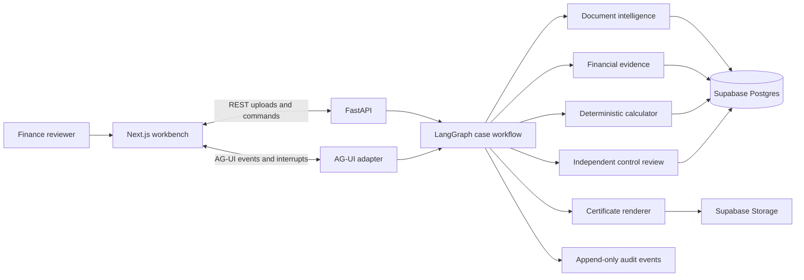
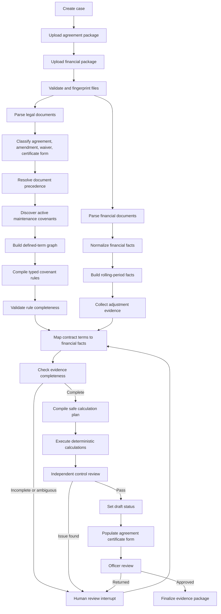

# Covenant Certificate Backend Architecture

Date: 2026-09-04

Status: proposed architecture, ready for approval before implementation

## 1. Architecture decision

Build a modular Python monolith with one LangGraph workflow.

Use:

- FastAPI for HTTP and file-upload APIs
- LangGraph for stateful orchestration and human-review interrupts
- Pydantic for domain contracts and structured model output
- Docling for PDF, DOCX, XLSX, HTML, table, and OCR parsing
- Supabase Postgres for case state, provenance, decisions, and audit events
- Supabase Storage for original and derived files
- A small allow-listed expression engine for covenant calculations
- AG-UI for typed event streaming to the frontend

Do not start with microservices, a general agent platform, or an unrestricted ReAct loop.

## 2. Product boundary

The backend completes one borrower-side finance workflow:

> Read the current loan agreement package and financial package, determine the applicable financial maintenance covenants, calculate them, route uncertain items for review, and produce an agreement-specific draft compliance certificate with a complete evidence trail.

The backend does not:

- Sign or legally certify compliance
- Give legal or accounting advice
- Determine lender remedies
- Execute arbitrary model-generated code
- Post entries to an ERP in the first version
- Monitor every affirmative, negative, or incurrence covenant
- Replace the authorized officer or lender review

## 3. System context



## 4. Design principles

1. The model proposes interpretations. Typed code validates them.
2. The model never performs final arithmetic.
3. Every material field has source provenance.
4. Missing information never defaults to zero.
5. A compliant result requires complete evidence.
6. Amendments and waivers are resolved before calculations begin.
7. The backend preserves every original file and every derived version.
8. Human decisions are explicit, versioned, and reversible before finalization.
9. The user sees domain artifacts, not model chain-of-thought.
10. Every node is idempotent and can be retried safely.

## 5. High-level workflow



## 6. LangGraph state machine

### Case statuses

```text
DRAFT
FILES_UPLOADED
PARSING
POLICY_COMPILING
FINANCIAL_MAPPING
EVIDENCE_REVIEW
CALCULATING
CONTROL_REVIEW
NEEDS_REVIEW
DRAFT_COMPLIANT
DRAFT_BREACH
CERTIFICATE_READY
OFFICER_APPROVED
FINALIZED
FAILED
```

`DRAFT_COMPLIANT` and `DRAFT_BREACH` are analytical outcomes. They are not legal certification.

### Graph nodes

| Node | Type | Responsibility |
|---|---|---|
| `validate_case_input` | Deterministic | Confirm required files, types, sizes, hashes, and metadata |
| `parse_documents` | Deterministic library | Run Docling and preserve page, table, heading, and bounding-box anchors |
| `classify_legal_documents` | LLM plus rules | Identify original agreement, amendment, waiver, and certificate form |
| `resolve_document_precedence` | LLM proposal plus deterministic validation | Build the controlling document chain for the test date |
| `discover_covenants` | LLM plus search | Find all candidate financial maintenance covenants |
| `build_definition_graph` | LLM plus deterministic graph traversal | Resolve nested defined terms and cross-references |
| `compile_rulebook` | LLM structured output | Produce candidate typed rules |
| `validate_rulebook` | Deterministic controls | Validate completeness, operators, dates, units, and citations |
| `extract_financial_facts` | Parser plus LLM mapping | Produce normalized facts with evidence |
| `build_measurement_period` | Deterministic | Construct quarter, trailing-four-quarter, or other required periods |
| `map_rule_inputs` | LLM proposal | Map rule components to financial facts and supporting schedules |
| `validate_evidence` | Deterministic controls | Reject missing, stale, inconsistent, or unsupported inputs |
| `compile_calculation_plan` | Deterministic | Convert the approved rule into an allow-listed operation tree |
| `execute_calculations` | Deterministic | Calculate ratios, thresholds, caps, and headroom |
| `independent_control_review` | Separate LLM context plus deterministic checks | Search for missed terms, wrong versions, or unsupported conclusions |
| `request_human_review` | Interrupt | Pause with one precise decision and its financial impact |
| `apply_human_decision` | Deterministic | Record approval, rejection, correction, source, and scope |
| `determine_draft_status` | Deterministic | Set review, compliant, or breach status |
| `render_certificate` | Deterministic template system | Populate the agreement-specific form and calculation schedule |
| `finalize_case` | Deterministic | Freeze versions and produce the evidence bundle |

### Routing rules

```text
If document precedence is unresolved         -> NEEDS_REVIEW
If covenant recall control fails             -> NEEDS_REVIEW
If a definition node has no evidence         -> NEEDS_REVIEW
If a financial fact has no evidence          -> NEEDS_REVIEW
If an adjustment is unsupported              -> NEEDS_REVIEW
If units or periods conflict                 -> NEEDS_REVIEW
If the control reviewer finds a material gap -> NEEDS_REVIEW
If all evidence is complete and all pass     -> DRAFT_COMPLIANT
If evidence is complete and any fail         -> DRAFT_BREACH
```

## 7. Agent boundaries

There are three bounded agent roles. They are not free-running peers.

### 7.1 Covenant Compiler

Purpose: turn the current agreement package into a typed, evidence-backed rulebook.

Allowed tools:

- `search_document_exact`
- `search_document_semantic`
- `read_page_region`
- `find_defined_term`
- `follow_cross_reference`
- `list_amendments`
- `compare_clause_versions`
- `find_certificate_form`
- `submit_rule_candidate`

Forbidden actions:

- Selecting financial values
- Running arithmetic
- Setting compliance status
- Silently resolving conflicting amendments

### 7.2 Financial Evidence Mapper

Purpose: map each agreement-defined calculation component to the correct financial evidence.

Allowed tools:

- `list_financial_documents`
- `read_statement_table`
- `read_debt_schedule`
- `read_cash_schedule`
- `read_lease_schedule`
- `read_adjustment_schedule`
- `normalize_currency`
- `normalize_period`
- `submit_fact_mapping`

Forbidden actions:

- Altering the covenant rule
- Approving unsupported adjustments
- Running final arithmetic
- Setting compliance status

### 7.3 Independent Control Reviewer

Purpose: try to disprove the proposed result.

It receives:

- Source documents
- Compiled rulebook
- Evidence mappings
- Calculation plan and output

It does not receive the other agents' hidden reasoning or persuasive narrative.

Checks:

- Missed active covenant
- Incomplete definition chain
- Wrong controlling amendment
- Wrong testing period
- Wrong entity scope
- Unsupported adjustment
- Missing cap
- Incorrect inequality
- Unit or sign mismatch
- Invalid source citation
- Unsupported compliant result

The reviewer may open an issue. It may not directly change source facts or approve the case.

## 8. Deterministic calculation engine

### Allowed operation tree

```text
Literal
FactReference
Add
Subtract
Multiply
Divide
Minimum
Maximum
AbsoluteValue
Negate
Sum
Conditional
Cap
PeriodAggregate
CurrencyConvert
Compare
```

No arbitrary Python, JavaScript, SQL, shell, or `eval` execution is allowed.

### Example

```json
{
  "operation": "Divide",
  "left": {
    "operation": "Subtract",
    "left": {"fact": "consolidated_funded_debt"},
    "right": {
      "operation": "Minimum",
      "values": [
        {"fact": "permitted_unrestricted_cash"},
        {"literal": 50000000}
      ]
    }
  },
  "right": {"fact": "consolidated_adjusted_ebitda"}
}
```

### Calculation output

Each output stores:

- Input fact IDs
- Input values and units
- Operation tree version
- Intermediate values
- Final value
- Applicable operator and threshold
- Absolute and percentage headroom
- Rounding rule
- Calculation timestamp
- Code version

## 9. Document intelligence subsystem

### Pipeline

```text
Original file
  -> SHA-256 fingerprint
  -> malware and type validation
  -> immutable storage
  -> Docling parse
  -> page-aware document JSON
  -> text spans and tables
  -> exact-term index
  -> Supabase Postgres full-text-search index
  -> optional embedding index
```

Exact search is primary for defined terms and section references. Semantic search is a recall aid, not the source of truth.

### Definition graph

Each node represents a defined term or operative clause.

```text
DefinitionNode
  id
  canonical_name
  normalized_name
  definition_text
  document_version_id
  locator
  effective_from
  effective_to
  evidence_span_id
  review_status
```

Edges:

- `REFERENCES`
- `AMENDS`
- `REPLACES`
- `EXCLUDES`
- `INCLUDES`
- `CAPS`
- `CONDITIONAL_ON`

Cycle detection is mandatory. A circular or unresolved chain produces a review issue.

### Amendment precedence

Never merge amendments into the original text destructively.

Store:

1. Original clause
2. Amendment instruction
3. Derived effective clause
4. Provenance connecting the derived clause to both sources
5. Effective date and affected test periods

## 10. Financial evidence subsystem

### Normalized fact model

```text
FinancialFact
  id
  case_id
  concept
  value_decimal
  currency
  unit_scale
  period_start
  period_end
  instant_date
  entity_scope
  source_document_id
  source_span_id
  derivation
  confidence
  review_status
```

Values must use decimal arithmetic. Do not store calculation inputs as binary floating-point numbers.

### Derived facts

A derived fact retains its complete dependency list.

```text
Adjusted EBITDA
  <- Net income
  <- Interest
  <- Taxes
  <- Depreciation
  <- Amortization
  <- Approved restructuring adjustment
  <- Applied adjustment cap
```

### Period controls

The engine must distinguish:

- Instant values, such as quarter-end debt or cash
- Duration values, such as quarterly income or interest
- Trailing-four-quarter aggregates
- Year-to-date values
- Pro forma values

Combining incompatible periods is a blocking error.

## 11. Review and approval subsystem

### Review issue types

```text
MISSING_DOCUMENT
UNRESOLVED_PRECEDENCE
MISSING_COVENANT
UNRESOLVED_DEFINITION
AMBIGUOUS_OPERATOR
AMBIGUOUS_THRESHOLD
MISSING_FINANCIAL_FACT
UNSUPPORTED_ADJUSTMENT
PERIOD_MISMATCH
UNIT_MISMATCH
ENTITY_SCOPE_MISMATCH
OCR_RISK
CONTROL_REVIEW_FAILURE
POTENTIAL_BREACH
OFFICER_APPROVAL_REQUIRED
```

### Human decision contract

Every decision records:

- Issue ID
- Selected action
- Optional corrected value or mapping
- Evidence supplied
- Reviewer identity
- Reviewer role
- Reason
- Scope: this case, this facility, or future cases
- Timestamp
- Superseded decision, if any

The first version should apply decisions only to the active case unless the reviewer explicitly selects a wider scope.

## 12. Core data model

| Table | Purpose |
|---|---|
| `cases` | Borrower, facility, test date, status, active graph run |
| `facilities` | Facility metadata and responsible parties |
| `documents` | Immutable source-file metadata and hashes |
| `document_versions` | Agreement, amendment, waiver, certificate-form versions |
| `document_spans` | Page-aware source text and table cells |
| `definition_nodes` | Defined terms and operative clauses |
| `definition_edges` | Cross-references and amendment relationships |
| `covenant_rules` | Versioned compiled covenant rules |
| `threshold_schedules` | Date and condition-based thresholds |
| `financial_facts` | Normalized sourced and derived facts |
| `fact_dependencies` | Lineage for derived facts |
| `fact_mappings` | Rule component to financial fact mappings |
| `calculation_plans` | Validated operation trees |
| `calculation_runs` | Inputs, intermediates, outputs, and headroom |
| `review_issues` | Blocking and non-blocking control findings |
| `human_decisions` | Reviewer resolutions and their scope |
| `certificates` | Draft and finalized artifacts |
| `workflow_checkpoints` | LangGraph PostgreSQL checkpoint metadata |
| `audit_events` | Append-only case event stream |
| `model_runs` | Prompt version, model, usage, latency, and output status |

Use foreign keys and immutable version rows for material domain artifacts. Corrections create new versions instead of overwriting prior evidence.

## 13. Backend API

### Cases

```text
POST   /api/cases
GET    /api/cases/{case_id}
GET    /api/cases/{case_id}/state
POST   /api/cases/{case_id}/run
POST   /api/cases/{case_id}/cancel
POST   /api/cases/{case_id}/retry
```

### Documents

```text
POST   /api/cases/{case_id}/documents
GET    /api/cases/{case_id}/documents
GET    /api/documents/{document_id}
GET    /api/documents/{document_id}/spans/{span_id}
GET    /api/documents/{document_id}/render?page={page}
```

### Covenant workbench

```text
GET    /api/cases/{case_id}/rulebook
GET    /api/cases/{case_id}/definition-graph
GET    /api/cases/{case_id}/financial-facts
GET    /api/cases/{case_id}/calculations
GET    /api/cases/{case_id}/evidence
```

### Review

```text
GET    /api/cases/{case_id}/review-issues
POST   /api/review-issues/{issue_id}/resolve
POST   /api/review-issues/{issue_id}/reject
POST   /api/cases/{case_id}/officer-approval
```

### Artifacts

```text
POST   /api/cases/{case_id}/certificate/render
GET    /api/cases/{case_id}/certificate
GET    /api/cases/{case_id}/evidence-package
```

### Events

```text
POST   /api/copilotkit
GET    /api/cases/{case_id}/events
GET    /api/cases/{case_id}/events/stream
```

AG-UI is the primary live event route. The ordinary event endpoint remains as a fallback and for debugging.

## 14. AG-UI event contract

The backend emits domain events, not hidden chain-of-thought.

```text
CASE_STARTED
DOCUMENT_ACCEPTED
DOCUMENT_PARSED
DOCUMENT_CLASSIFIED
PRECEDENCE_RESOLVED
COVENANT_DISCOVERED
DEFINITION_RESOLVED
RULE_COMPILED
FINANCIAL_FACT_MAPPED
EVIDENCE_CHECK_FAILED
CALCULATION_COMPLETED
CONTROL_REVIEW_COMPLETED
HUMAN_REVIEW_REQUIRED
HUMAN_DECISION_APPLIED
DRAFT_STATUS_SET
CERTIFICATE_RENDERED
CASE_FINALIZED
CASE_FAILED
```

Each event includes:

```json
{
  "event_id": "uuid",
  "case_id": "uuid",
  "run_id": "uuid",
  "sequence": 42,
  "event_type": "CALCULATION_COMPLETED",
  "occurred_at": "ISO-8601",
  "summary": "Maximum net leverage calculated at 4.31x",
  "entity_refs": {},
  "artifact_refs": [],
  "public_payload": {}
}
```

## 15. Idempotency and retries

### Idempotency keys

Node execution key:

```text
case_id + node_name + input_artifact_hashes + prompt_version + code_version
```

If the key already completed, reuse the stored result.

### Retry policy

- Parsing: one retry with alternate parser settings
- Model transport failures: exponential retry with a small fixed maximum
- Invalid structured output: one repair attempt, then review
- Missing evidence: no automatic retry
- Conflicting documents: no automatic resolution
- Calculation error: fail closed and retain inputs
- Certificate rendering error: retry without rerunning analysis

Never retry a human rejection as if it were a transient failure.

## 16. Security and trust boundaries

Uploaded contracts and tool outputs are untrusted data.

Controls:

- File type and size allow-list
- Filename normalization
- Immutable content hashes
- No macros or embedded script execution
- No arbitrary shell or code tools exposed to agents
- Prompt-injection boundary around document text
- Tenant and case scoping on every query, with RLS as defense in depth
- Signed artifact URLs or application-mediated downloads
- Secrets kept only in server environment variables
- Model inputs and outputs excluded from public logs
- Source files excluded from analytics
- Audit events redact secrets and personal data where possible
- Generated certificates visibly marked `DRAFT` until officer approval

The model cannot directly:

- Change case status
- Mark a review issue resolved
- Approve an adjustment
- Finalize a certificate
- Write arbitrary database records

It submits typed proposals that deterministic services validate and persist.

## 17. Observability

Record one trace per case run and one span per graph node.

Metrics:

- Node latency
- Model latency and token usage
- Parser failures by document type
- Structured-output validation failures
- Number of unresolved definitions
- Covenant recall control failures
- Human review count
- False-compliant count in evaluation
- Calculation mismatch count
- Certificate generation failures

Use OpenTelemetry-compatible spans. Neatlogs can be added as the hackathon trace viewer if its integration is confirmed.

## 18. Evaluation architecture

### Test layers

1. Unit tests for formula operations, period handling, caps, and comparisons.
2. Parser fixtures for pages, tables, decimals, inequalities, and OCR.
3. Rule-compilation fixtures for definitions, cross-references, schedules, and amendments.
4. Evidence-mapping fixtures for financial facts and adjustments.
5. Graph tests for status transitions and interrupts.
6. End-to-end gold cases from documents to draft certificate.

### Required evaluation cases

- Same financials, two agreements, opposite results
- Original agreement versus current amendment
- Unsupported EBITDA adjustment
- Operating lease included versus excluded
- Restricted cash incorrectly proposed for netting
- Rolling-four-quarter period assembled from quarterly values
- Springing covenant inactive because trigger is not met
- OCR corruption of `4.00` into `400`
- Missed covenant detection
- Conflicting waiver and amendment

### Release gates

```text
Calculation accuracy             = 100%
Unsupported compliant outcomes   = 0
Citation presence                = 100%
Amendment precedence gold cases  = 100%
Critical graph transition tests  = 100%
```

Extraction quality can improve iteratively. The safety gates cannot be weakened to make the demo pass.

## 19. Suggested repository structure

```text
covenant-certificate/
├── apps/
│   ├── api/
│   │   ├── main.py
│   │   ├── routes/
│   │   └── dependencies.py
│   └── web/
├── src/covenant_certificate/
│   ├── domain/
│   │   ├── cases.py
│   │   ├── documents.py
│   │   ├── covenants.py
│   │   ├── definitions.py
│   │   ├── financial_facts.py
│   │   ├── calculations.py
│   │   ├── reviews.py
│   │   └── certificates.py
│   ├── workflows/
│   │   ├── case_graph.py
│   │   ├── state.py
│   │   ├── nodes/
│   │   └── routing.py
│   ├── agents/
│   │   ├── covenant_compiler.py
│   │   ├── financial_mapper.py
│   │   └── control_reviewer.py
│   ├── tools/
│   │   ├── document_tools.py
│   │   ├── definition_tools.py
│   │   ├── financial_tools.py
│   │   └── review_tools.py
│   ├── calculation/
│   │   ├── ast.py
│   │   ├── compiler.py
│   │   ├── evaluator.py
│   │   └── controls.py
│   ├── parsing/
│   │   ├── docling_adapter.py
│   │   ├── normalizer.py
│   │   └── indexing.py
│   ├── persistence/
│   │   ├── models.py
│   │   ├── repositories.py
│   │   └── migrations/
│   ├── events/
│   │   ├── schema.py
│   │   └── agui_adapter.py
│   └── rendering/
│       ├── certificate.py
│       └── evidence_package.py
├── tests/
│   ├── unit/
│   ├── integration/
│   ├── graph/
│   ├── evals/
│   └── fixtures/
├── evals/
│   ├── gold/
│   ├── datasets/
│   └── reports/
├── sample_data/
├── pyproject.toml
└── README.md
```

## 20. Deployment shape

For the demonstration:

```text
One Python API process
One Next.js process
One Supabase Postgres database
One Supabase Storage bucket for private artifacts
External model API
```

Do not add Redis, Celery, Kafka, Kubernetes, a separate vector database, or distributed workers unless a measured limitation requires them.

For a later production system, revisit:

- Durable background workers
- Tenant isolation
- Enterprise authentication and authorization
- Encryption and retention controls
- ERP and document-system connectors
- Electronic signature integration
- Formal policy governance

## 21. Demonstration data flow

```text
1. User selects Demo Company and Q2 2026.
2. User uploads Agreement A, Agreement B, and one financial package.
3. Both legal packages are parsed in parallel.
4. The graph compiles two different definition trees.
5. One financial fact set is mapped to both policies.
6. Deterministic calculations produce PASS and BREACH.
7. The UI highlights the exact definition causing the difference.
8. A second case pauses on an unsupported add-back.
9. The reviewer supplies evidence or rejects the adjustment.
10. The graph resumes and prepares the agreement-specific draft certificate.
11. The evidence package shows documents, clauses, inputs, calculations, decisions, and versions.
```

## 22. Decisions to lock before coding

1. Confirm LangGraph as the orchestration runtime.
2. Confirm Supabase Postgres and private Supabase Storage for the demonstration deployment.
3. Confirm the first supported covenant family: maximum leverage ratio, with interest coverage as the second only if the same architecture supports it cleanly.
4. Select the public agreement, amendment, certificate form, and financial package used for the gold demonstration.
5. Obtain expert review for the expected rule, calculation, and draft result.
6. Decide the model provider after testing structured extraction on the selected documents.

## 23. Final recommendation

Build a controlled finance workflow on LangGraph, not a general agent harness. Keep contract interpretation and financial mapping agentic. Keep document precedence, evidence completeness, calculations, state transitions, approvals, and finalization deterministic.

The architecture succeeds when the demonstration can answer all five questions visibly:

1. Which contract clause controls?
2. Which financial lines feed the calculation?
3. What exact calculation was executed?
4. Why did the system pass, fail, or stop?
5. Who reviewed the unresolved judgment?
